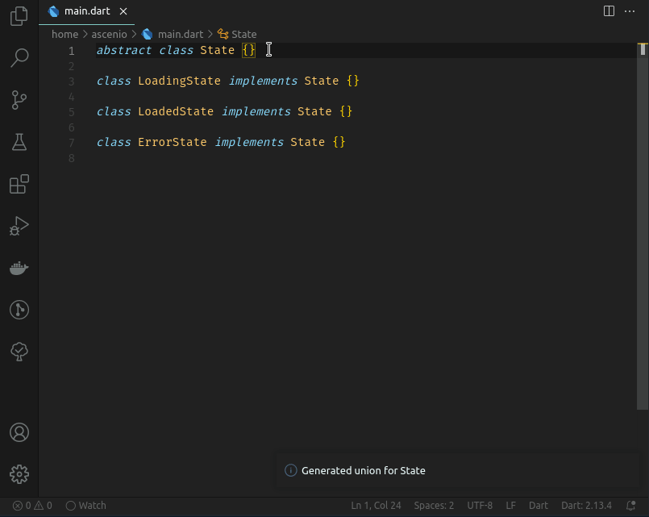

#  Dart Union Class

Generates *simple* extension methods to simulate unions in Dart. No need for code generation, because I'm sure we all love that.



## :muscle: Features

### `map`

You can act differently on each possible value.

```dart
void main() {
  final state = getUser();
  state.map(
    loadingState: (_) {
      print('Loading..');
    },
    loadedState: (_) {
      print("You're good to go!");
    },
    errorState: (_) {
      print('Oops, something happened!');
    },
  );
}
```

But also return values accordingly.

```dart
Widget build(BuildContext context) {
  final state = getUser();
  state.map(
    loadingState: (_) {
      return CircularProgressIndicator();
    },
    loadedState: (loaded) {
      return Text('Hello, ${loaded.userName}!');
    },
    errorState: (error) {
      return Text('Something bad happened: $error');
    },
  );
}
```

## :shipit: Inspiration

Totally original idea right there. Definitely not inspired by [Dart Data Class](https://github.com/bnxm/dart-data-class-generator) and [Freezed](https://github.com/rrousselGit/freezed).
